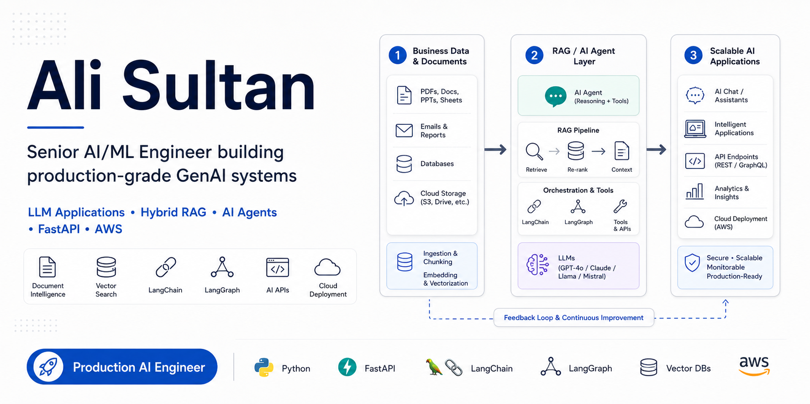

  

## 🤝 Let's Connect

  
  

## 🚀 About Me

I'm a **Senior AI/ML Engineer** with 3+ years of experience in architecting and productionizing **LLM applications**, **RAG pipelines**, and **AI-powered systems**. My work focuses on turning GenAI ideas into reliable, scalable products using Python, LangChain, vector databases, and AWS.

### What I focus on
- Building **LLM-powered applications** that are useful in real production environments
- Designing **RAG systems** with clean retrieval, grounding, and response pipelines
- Developing **AI agents** and orchestration workflows for multi-step reasoning
- Shipping **cloud-ready AI backends** with APIs, observability, and scalability
- Teaching and mentoring the next wave of AI engineers through university-level instruction

## 🧠 Core Strengths

| Area | What I bring |
|------|---------------|
| **LLM Engineering** | Prompt engineering, chaining, structured outputs, evaluation, optimization |
| **RAG Systems** | Document ingestion, embeddings, chunking, vector retrieval, source-grounded answers |
| **AI Agents** | Multi-step workflows, tool usage, orchestration with LangChain / LangGraph |
| **Backend AI APIs** | FastAPI services, production endpoints, routing, validation, monitoring |
| **Cloud & LLMOps** | AWS Bedrock, SageMaker, EC2, S3, Lambda, deployment and scaling |
| **Applied AI Mentoring** | Curriculum design, student mentoring, practical AI project guidance |

## ⚙️ Tech Stack

### Languages & Frameworks

  
  
  
  

### Generative AI / LLM

  
  
  
  
  
  

### Vector Databases & Data

  
  
  
  
  

### Cloud & DevOps

  
  
  
  
  
  
  
  

## 💼 Featured Projects

### 1) Hybrid Intelligent Chatbot
Production-grade **hybrid RAG API** that routes every query down exactly one path:

- **SQL pipeline** for structured data questions
- **Vector pipeline** for document and policy retrieval
- Built with **FastAPI**, **LangGraph**, **LangChain**, **Streamlit**, and configurable vector backends
- Designed with **hexagonal architecture**, route isolation, source attribution, health probes, and security guardrails

### 2) Intelligent Social Media Automation Platform
A full **RAG-based LLM system** for automated social media content generation and response handling.

- Context-aware generation using embeddings and vector search
- LangChain-based orchestration for relevance and brand alignment
- Deployed on AWS with cost optimization and low-latency focus

### 3) LLM Fine-Tuning & Evaluation Framework
A practical framework for improving domain-specific LLM performance.

- Fine-tuning and optimization of open-source LLMs
- Evaluation pipelines for relevance, accuracy, and efficiency
- Focused on reducing hallucinations and improving production quality

### 4) Generative AI Curriculum & Student Projects
Hands-on AI education designed around modern LLM engineering.

- Built curriculum on RAG, embeddings, fine-tuning, and LLM applications
- Guided student teams toward production-ready AI prototypes
- Connected academic learning with industry-focused implementation

## 🏢 Experience Snapshot

### **AI Engineer** — Nerdware Tech  
`Apr 2023 – Present`

- Built and deployed production-grade RAG pipelines for intelligent automation
- Led prompt optimization, fine-tuning, and evaluation efforts
- Architected AI systems on AWS using EC2, S3, Bedrock, and Lambda
- Worked across backend APIs, model integration, scalability, and production delivery

### **Lecturer – Computer Science & AI** — COMSATS University Islamabad  
`Aug 2024 – Present`

- Teaching AI, Python, and Generative AI to undergraduate students
- Designed hands-on modules on LLMs, RAG, embeddings, and NLP applications
- Mentoring students on AI research and practical project implementation

## 📐 What makes my work different

- I care about **production-readiness**, not just demos
- I design systems with **clean architecture and maintainability**
- I focus on **grounded AI outputs**, observability, and scalability
- I enjoy bridging **industry engineering** with **teaching and mentoring**
- I like building AI systems that are both technically solid and practically useful

## 🤝 Let's Connect

  
  

Open to collaborating on <b>LLM apps, RAG systems, AI agents, and production AI engineering</b>.

